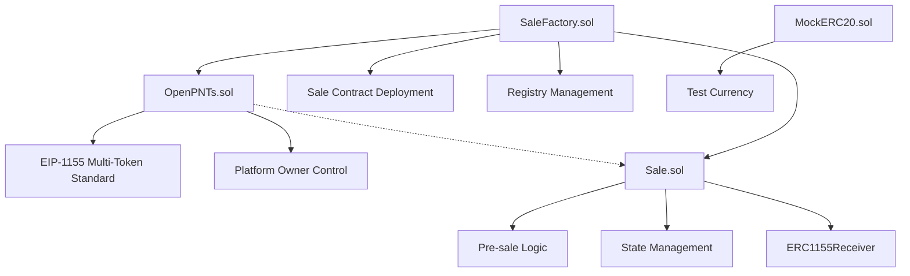
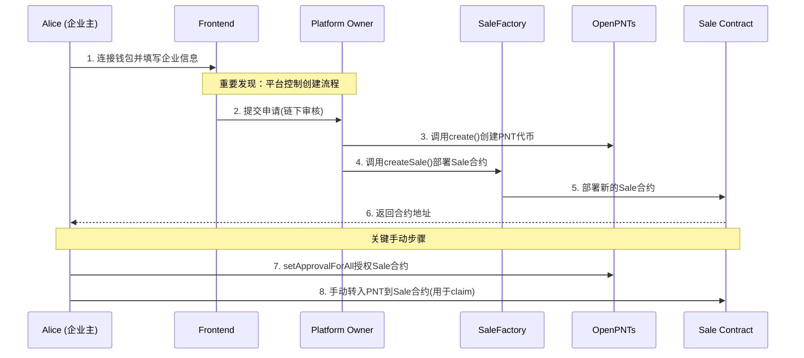
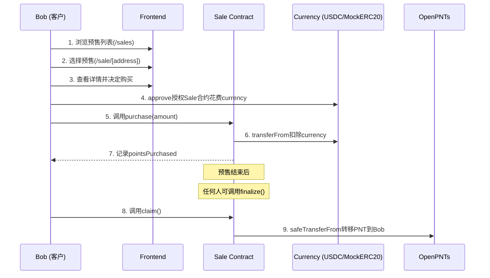
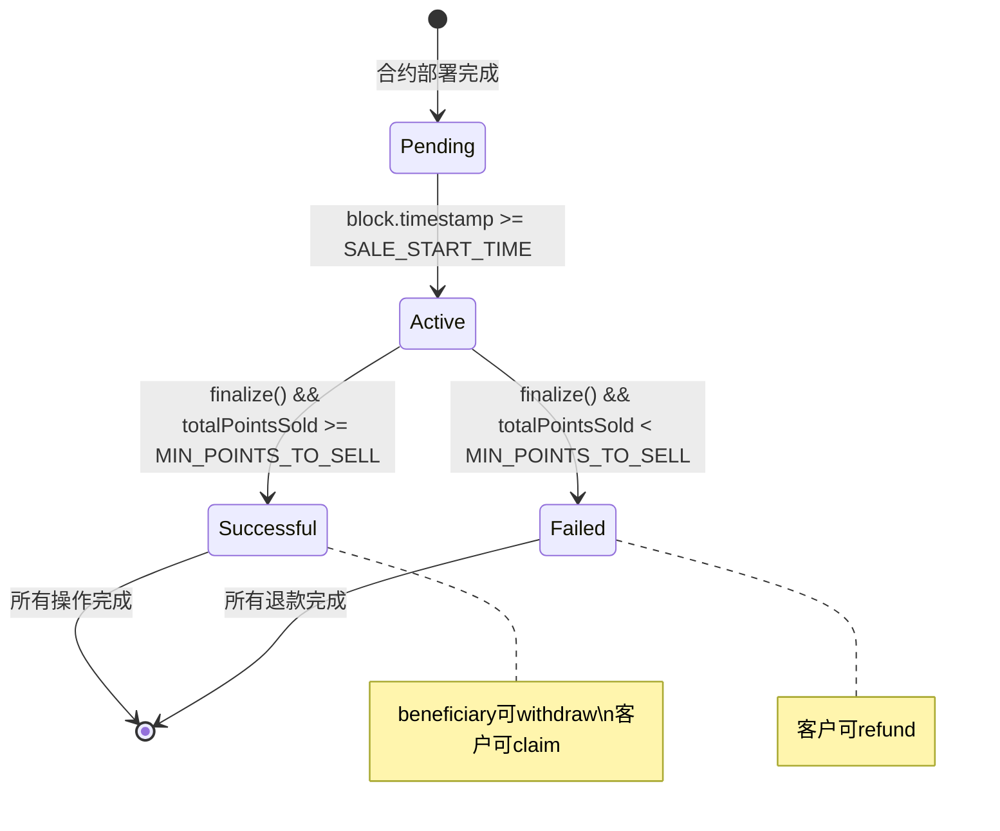

# 项目设计理解文档：OpenPNTs 链上忠诚度积分平台

## 1. 项目概述与愿景

### 核心愿景
OpenPNTs是一个基于区块链的忠诚度积分平台，旨在为小型企业提供创建、发行和管理链上忠诚度积分的简单工具。平台通过智能合约技术，实现了传统忠诚度积分系统的数字化升级，提供透明、安全、可验证的积分生态。

### 目标定位
- **主要服务对象**: 小型企业（如咖啡店、餐厅等）和其忠实客户
- **核心价值**: 降低忠诚度计划的技术门槛，提升客户参与度和信任度
- **技术特色**: 基于EIP-1155标准的多代币系统，支持批量操作和低Gas费用

## 2. 技术架构深度分析

### 2.1 智能合约架构

#### 核心合约体系


#### OpenPNTs.sol - 主代币合约
- **标准**: EIP-1155 (多代币标准)
- **设计理念**: 单一合约管理所有企业的忠诚度积分
- **权限模型**: Platform Owner控制代币创建
- **核心功能**:
  - `create(address creator, uint256 initialSupply)`: 为企业创建新的代币类型
  - `uri(uint256 tokenId)`: 元数据管理，支持{id}占位符
  - `setURI(string memory newURI)`: 动态元数据更新
- **安全特性**: 继承Ownable，只有平台方能创建新代币类型

#### Sale.sol - 预售合约
- **设计模式**: 状态机模式，包含5个状态：Pending, Active, Successful, Failed, Closed
- **状态流转**: Pending → Active → Successful/Failed
- **核心功能模块**:
  - **购买模块**: `purchase(uint256 amount)` - 用户购买积分，包含时间和数量验证
  - **结算模块**: `finalize()` - 任何人都可调用，基于最小目标确定成功/失败
  - **提取模块**: `withdraw()` - 仅beneficiary可调用，成功时提取收益
  - **领取模块**: `claim()` - 客户领取积分，需要beneficiary先转入PNT
  - **退款模块**: `refund()` - 失败销售的资金退回
- **安全特性**: 使用SafeERC20防止重入攻击，严格的状态检查

#### SaleFactory.sol - 工厂合约
- **权限模型**: 只有平台owner能创建Sale合约，而非企业主直接创建
- **核心功能**: 
  - `createSale()` - 部署新的Sale合约
  - `deployedSales[]` - 维护已部署销售合约列表
- **事件**: `SaleCreated` - 便于前端索引和监听
- **设计理念**: 中心化的销售合约创建，确保合约标准化和安全性

### 2.2 前端技术栈

#### 核心技术选型
- **框架**: Next.js 15.3.5 (React 19)
- **Web3集成**: Wagmi 2.15.6 + Viem 2.31.7
- **样式**: Tailwind CSS 4.0
- **状态管理**: @tanstack/react-query 5.51.1
- **钱包连接器**: @wagmi/connectors 5.8.5

#### 页面架构分析
```mermaid
graph LR
    A[/] --> B[主页 - 平台介绍]
    C[/create] --> D[企业创建预售页面]
    E[/sales] --> F[预售列表页面]
    G[/sale/[address]] --> H[单个预售详情页]
    I[/dashboard] --> J[用户仪表板]
```

#### 关键前端特性
- **动态ABI加载**: 从编译输出的JSON文件中导入ABI
- **环境变量配置**: 支持本地开发和测试网部署
- **复杂状态管理**: 使用Wagmi hooks处理多个并发的合约读取
- **元数据获取**: 动态获取和渲染PNT元数据
- **交易状态跟踪**: 完整的交易生命周期管理

## 3. 实际业务流程分析 (基于代码实现)

### 3.1 真实的企业端流程 (与设计文档的差异)



**关键发现**：
1. **平台中心化控制**：企业主不能直接创建Sale合约，必须通过Platform Owner
2. **手动PNT转移**：企业主需要在销售成功后手动转入PNT供客户领取
3. **双重权限验证**：既需要平台审核，又需要企业主操作

### 3.2 客户端流程 (Bob's Journey)



### 3.3 状态管理流程



## 4. 关键技术实现细节

### 4.1 权限和安全模型

#### 分层权限设计
- **Platform Owner**: 
  - 控制OpenPNTs合约创建新代币类型
  - 控制SaleFactory创建新销售合约
  - 设置元数据URI
- **Business Owner (Beneficiary)**:
  - 接收销售收益
  - 需要手动转入PNT给Sale合约用于客户claim
- **Customer**:
  - 购买积分
  - 在成功销售后claim积分
  - 在失败销售后refund

#### 安全措施
```solidity
// 重入保护
using SafeERC20 for IERC20;

// 状态检查
require(saleState == State.Active, "Sale is not active");
require(block.timestamp <= SALE_END_TIME, "Sale has ended");

// 权限验证
require(msg.sender == BENEFICIARY, "Only beneficiary can withdraw");
```

### 4.2 测试覆盖分析

#### 完整的测试场景
```solidity
// OpenPNTs测试
test_InitialState() // 初始状态验证
test_CreatePNT() // PNT创建功能
test_Fail_CreatePNT_NotOwner() // 权限验证

// Sale测试
test_Lifecycle_SuccessfulSale() // 完整成功流程
test_Lifecycle_FailedSale() // 完整失败流程
```

#### 测试验证的关键流程
1. **成功销售**: 购买 → 达到最小目标 → finalize → claim + withdraw
2. **失败销售**: 购买 → 未达最小目标 → finalize → refund

### 4.3 部署架构

#### 本地开发环境 (dev.sh)
```bash
# 1. 启动Anvil本地链
anvil > /dev/null 2>&1 &

# 2. 部署合约并获取地址
DEPLOY_OUTPUT=$(forge script script/Deploy.s.sol:DeployOpenPNTs ...)

# 3. 启动前端并传入合约地址
NEXT_PUBLIC_OPEN_PNTS_ADDRESS=$OPEN_PNTS_ADDRESS \
NEXT_PUBLIC_SALE_FACTORY_ADDRESS=$SALE_FACTORY_ADDRESS \
pnpm dev &
```

#### 测试网部署 (deploy-sepolia.sh)
```bash
# 1. 部署到Sepolia并验证合约
forge script script/Deploy.s.sol:DeployOpenPNTs \
    --rpc-url $SEPOLIA_RPC_URL \
    --broadcast \
    --verify \
    --etherscan-api-key $ETHERSCAN_API_KEY
```

### 4.4 前端数据流管理

#### 复杂的状态同步
```typescript
// 批量读取销售合约数据
const saleContracts = allSaleAddresses.flatMap(addr => [
  { address: addr, abi: SaleABI, functionName: 'PNT_CONTRACT' },
  { address: addr, abi: SaleABI, functionName: 'TOKEN_ID' },
  // ... 11个并发调用每个销售合约
]);

// 异步获取元数据
useEffect(() => {
  const fetchAllPntMetadata = async () => {
    const metadataUrl = uri.replace('{id}', tokenId.toString());
    const response = await fetch(metadataUrl);
    // ...
  };
}, [pntUriData]);
```

## 5. 核心创新点分析

### 5.1 架构创新
- **中心化创建，去中心化执行**: Platform控制合约创建，但每个销售独立执行
- **标准化合约模板**: 通过Factory确保所有销售合约的一致性
- **状态机设计**: 清晰的状态转换逻辑，便于前端状态管理

### 5.2 用户体验创新
- **手动PNT转入机制**: 企业主需要主动转入PNT，确保有足够token进行分发
- **任何人可finalize**: 降低对特定角色的依赖，提高系统robust性
- **完整的失败处理**: 失败销售的完整退款机制

## 6. 当前实现状态评估

### 6.1 已完成功能
- ✅ 完整的智能合约架构 (OpenPNTs + SaleFactory + Sale)
- ✅ 全面的测试覆盖 (成功/失败场景)
- ✅ 本地开发环境自动化 (dev.sh)
- ✅ 测试网部署脚本 (deploy-sepolia.sh)
- ✅ 现代化前端框架 (Next.js + Wagmi)
- ✅ 复杂的状态管理和数据同步
- ✅ MockERC20用于开发和测试

### 6.2 架构上的重要发现
- **权限模型**: 平台中心化控制合约创建，而非完全去中心化
- **手动流程**: 企业主需要手动转入PNT用于客户claim
- **状态驱动**: 严格的状态机确保业务逻辑正确执行
- **测试完备**: 覆盖了主要的成功和失败场景

### 6.3 待完善功能
- 🔄 前端错误处理优化
- 🔄 移动端响应式设计
- 🔄 元数据服务实现
- 🔄 业务验证流程
- 🔄 Gas费优化

## 7. 技术决策合理性分析

### 7.1 架构优势
1. **安全第一**: 中心化创建确保合约质量，去中心化执行保证透明度
2. **测试驱动**: 完整的测试覆盖确保合约逻辑正确性
3. **开发友好**: 完整的本地开发环境和部署脚本
4. **标准兼容**: 基于成熟的EIP-1155和OpenZeppelin

### 7.2 实际的业务流程约束
1. **Platform Owner Gate**: 企业不能直接创建，需要平台方参与
2. **手动PNT Transfer**: 企业主需要理解并执行token转移
3. **Gas费成本**: 多次交互可能产生较高的gas费用
4. **技术门槛**: 仍需要企业主有一定的Web3知识

## 8. 风险评估与建议

### 8.1 技术风险
- **智能合约风险**: 建议进行专业审计，特别是状态转换逻辑
- **中心化风险**: Platform Owner的权限过大，建议多签或DAO治理
- **用户体验风险**: 手动PNT转入可能导致用户困惑

### 8.2 业务风险
- **监管合规**: 明确法律地位，避免证券化风险
- **平台依赖**: 企业完全依赖平台方创建销售合约
- **技术采用**: 需要企业主学习Web3操作

## 9. 核心代码架构总结

### 9.1 智能合约层次
```
Platform Owner
├── OpenPNTs (EIP-1155)
│   ├── create() - 创建新代币类型
│   └── setURI() - 管理元数据
├── SaleFactory (Factory Pattern)
│   ├── createSale() - 部署Sale合约
│   └── deployedSales[] - 合约注册表
└── Sale Contracts (State Machine)
    ├── purchase() - 购买逻辑
    ├── finalize() - 状态确定
    ├── claim/withdraw/refund() - 资金分配
    └── ERC1155Receiver - 安全接收PNT
```

### 9.2 前端组件架构
```
Next.js App
├── Providers (Wagmi + React Query)
├── Pages
│   ├── /create - 企业创建表单
│   ├── /sales - 销售列表
│   └── /sale/[address] - 销售详情
├── Hooks (Wagmi)
│   ├── useReadContract - 批量读取
│   ├── useWriteContract - 交易执行
│   └── useWaitForTransactionReceipt - 状态跟踪
└── Utils
    ├── constants.ts - 合约地址
    └── abis.ts - 合约ABI
```

## 10. 总结

OpenPNTs项目展现了一个thoughtful的区块链业务应用设计。通过深入的代码分析，我发现项目具有以下特点：

**技术优势**:
1. **严格的权限模型**: 平台控制合约创建，确保标准化和安全性
2. **完整的测试覆盖**: 包含成功和失败场景的全面测试
3. **现代化技术栈**: 使用最新的Web3开发工具和框架
4. **状态机设计**: 清晰的业务逻辑状态转换

**实际约束**:
1. **中心化依赖**: 企业不能独立创建销售，需要平台方参与
2. **手动操作**: 企业主需要手动转入PNT用于客户claim
3. **技术门槛**: 仍需要一定的Web3知识和操作能力

**未来发展方向**:
1. **权限去中心化**: 考虑引入DAO治理或更灵活的权限机制
2. **用户体验优化**: 简化手动操作，提供更好的引导
3. **业务扩展**: 从忠诚度积分扩展到更广泛的数字资产应用

项目的核心价值在于为传统企业提供了一个相对安全、标准化的区块链忠诚度积分解决方案，虽然存在一定的中心化约束，但在当前的监管环境和技术成熟度下是一个合理的平衡。 