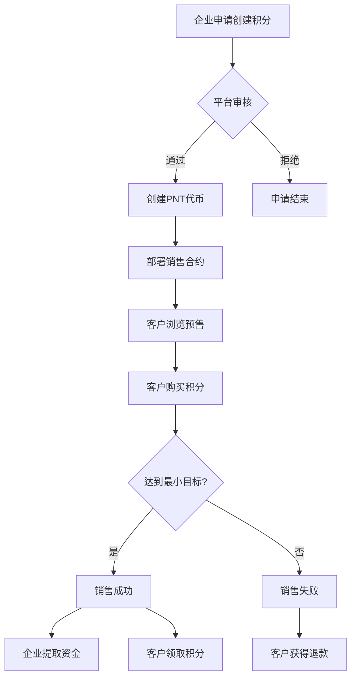
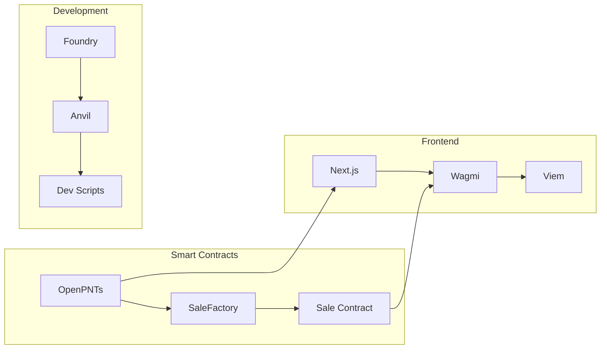

# OpenPNTs 平台核心功能特性

## 1. 功能特性概览

基于对项目深度分析，OpenPNTs平台为小型企业和客户提供了完整的链上忠诚度积分解决方案。以下是按用户群体和技术层面分解的核心功能特性。

## 2. 企业端功能特性 (Business Owner Features)

### 2.1 数字积分卡创建
**客户价值描述**: 企业主可以像申请传统积分卡一样，轻松创建属于自己企业的数字忠诚度积分。

**产品设计描述**: 
- 简洁的表单界面，企业主填写基本信息
- 自动化的积分代币创建和销售合约部署
- 企业验证机制增强客户信任度

**技术实现描述**:
```solidity
// 平台为企业创建EIP-1155代币
function create(address creator, uint256 initialSupply) public onlyOwner returns (uint256)

// 自动部署独立的销售合约
function createSale(...parameters) external onlyOwner returns (address)
```

**流程图**:


### 2.2 预售活动管理
**客户价值描述**: 企业可以设置灵活的预售参数，包括价格、数量、时间等，完全控制自己的积分销售策略。

**产品设计描述**:
- 预售目标设置（最大和最小销售量）
- 价格策略配置（每积分的USDC价格）
- 时间窗口控制（开始和结束时间）
- 自动成功/失败判定机制

**技术实现描述**:
- 状态机控制销售流程
- 时间锁定和条件验证
- 自动资金管理和分配

### 2.3 资金收取与积分分发
**客户价值描述**: 销售成功后，企业主可以安全收取资金，并为客户提供积分。

**产品设计描述**:
- 成功销售后的一键资金提取
- 手动PNT转入确保积分供应
- 透明的资金流向和状态跟踪

**技术实现描述**:
```solidity
// 企业主提取销售收益
function withdraw() external

// 客户领取购买的积分
function claim() external
```

## 3. 客户端功能特性 (Customer Features)

### 3.1 预售项目发现
**客户价值描述**: 客户可以浏览和发现感兴趣的本地企业积分预售项目。

**产品设计描述**:
- 清晰的预售项目列表页面
- 企业验证信息展示（地图链接、照片等）
- 预售状态和进度可视化

**技术实现描述**:
```typescript
// 批量获取所有销售合约数据
const saleContracts = allSaleAddresses.flatMap(addr => [
  { address: addr, abi: SaleABI, functionName: 'BENEFICIARY' },
  { address: addr, abi: SaleABI, functionName: 'totalPointsSold' },
  // ... 更多合约数据
]);
```

### 3.2 安全的积分购买
**客户价值描述**: 客户可以使用稳定币（USDC）安全购买企业积分，享受区块链透明度保障。

**产品设计描述**:
- 直观的购买界面和数量选择
- 实时价格计算和Gas费估算
- 交易状态实时跟踪

**技术实现描述**:
```solidity
// 客户购买积分
function purchase(uint256 amount) external {
    require(saleState == State.Active, "Sale is not active");
    uint256 cost = amount * PRICE;
    CURRENCY.safeTransferFrom(msg.sender, address(this), cost);
}
```

### 3.3 积分领取与管理
**客户价值描述**: 购买成功后，客户可以领取积分到自己的钱包，实现真正的数字资产所有权。

**产品设计描述**:
- 成功销售后的积分领取按钮
- 钱包中的积分余额查看
- 未来可与企业POS系统集成使用

**技术实现描述**:
```solidity
// 基于EIP-1155的安全转移
PNT_CONTRACT.safeTransferFrom(address(this), msg.sender, TOKEN_ID, amountToClaim, "");
```

### 3.4 失败保护机制
**客户价值描述**: 如果企业未达到最小销售目标，客户可以获得100%资金退回。

**产品设计描述**:
- 自动失败检测和状态更新
- 一键退款功能
- 完整的资金保护机制

**技术实现描述**:
```solidity
// 失败销售的退款机制
function refund() external {
    require(saleState == State.Failed, "Sale was not failed");
    uint256 cost = amountToRefund * PRICE;
    CURRENCY.safeTransfer(msg.sender, cost);
}
```

## 4. 平台级功能特性 (Platform Features)

### 4.1 标准化合约管理
**客户价值描述**: 平台确保所有积分和销售合约的标准化和安全性。

**产品设计描述**:
- 统一的合约模板和安全标准
- 中心化的质量控制
- 去中心化的执行透明度

**技术实现描述**:
- Factory模式确保合约一致性
- OpenZeppelin标准库保障安全性
- 完整的测试覆盖验证功能

### 4.2 元数据服务
**客户价值描述**: 积分具有丰富的元数据，包括名称、描述、图片等。

**产品设计描述**:
- 动态元数据URI支持
- {id}占位符自动替换
- 未来支持IPFS去中心化存储

**技术实现描述**:
```solidity
function uri(uint256 tokenId) public view override returns (string memory) {
    return super.uri(tokenId); // 支持{id}占位符
}
```

### 4.3 开发者友好环境
**客户价值描述**: 为技术团队提供完整的开发和部署工具。

**产品设计描述**:
- 一键本地开发环境启动
- 自动化合约部署和验证
- 完整的测试套件

**技术实现描述**:
```bash
# dev.sh 自动化流程
anvil & # 启动本地链
forge script script/Deploy.s.sol # 部署合约
pnpm dev # 启动前端
```

## 5. 技术特性亮点

### 5.1 EIP-1155多代币标准
**技术优势**:
- 单一合约管理多种积分类型
- 支持批量操作，降低Gas费用
- 原生支持元数据和可视化

### 5.2 状态机销售管理
**技术优势**:
- 清晰的状态转换逻辑
- 自动化的成功/失败判定
- 防止状态混乱和资金风险

### 5.3 安全第一的设计
**技术优势**:
- SafeERC20防重入攻击
- 严格的权限验证
- 完整的测试覆盖

## 6. 功能流程图

### 6.1 完整用户流程


### 6.2 技术流程图


## 7. 未来功能规划

### 7.1 增强功能 (Phase 2)
- **高级企业验证**: 自动化的企业信誉评分
- **保险基金**: 平台级的风险保护机制
- **移动端支持**: React Native应用
- **社交功能**: 推荐奖励系统

### 7.2 集成功能 (Phase 3)
- **POS集成**: 线下积分消费
- **DeFi集成**: 积分质押和收益
- **账户抽象**: 无Gas费用户体验
- **多链支持**: 扩展到更多L2网络

## 8. 竞争优势分析

### 8.1 相比传统积分系统
- ✅ **透明度**: 链上可验证的积分余额和交易
- ✅ **互操作性**: 跨平台的积分使用
- ✅ **防伪造**: 区块链防篡改特性
- ✅ **全球可访问**: 无地域限制

### 8.2 相比其他区块链方案
- ✅ **专业化**: 专注于小企业忠诚度场景
- ✅ **低门槛**: 简化的Web3交互
- ✅ **安全性**: 平台级的质量控制
- ✅ **合规性**: 明确的法律框架定位

## 9. 成功指标 (KPIs)

### 9.1 业务指标
- 注册企业数量
- 活跃预售项目数
- 客户购买积分总量
- 平均预售成功率

### 9.2 技术指标
- 合约部署成功率
- 交易确认时间
- Gas费用优化率
- 系统可用性 (uptime)

### 9.3 用户体验指标
- 用户注册转化率
- 购买流程完成率
- 客户满意度评分
- 企业主推荐率

这些功能特性构成了OpenPNTs平台的核心价值主张，为小型企业提供了一个安全、透明、易用的链上忠诚度积分解决方案。 